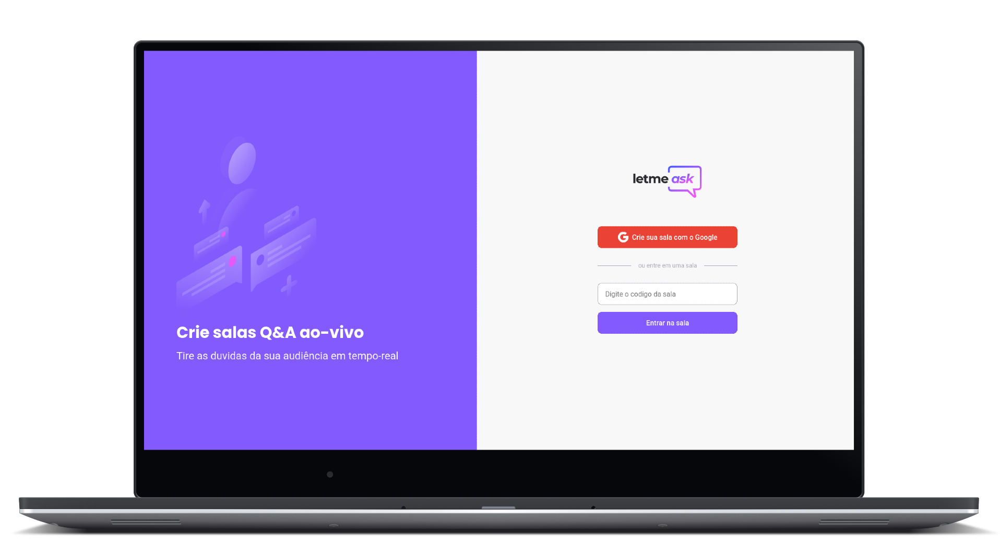
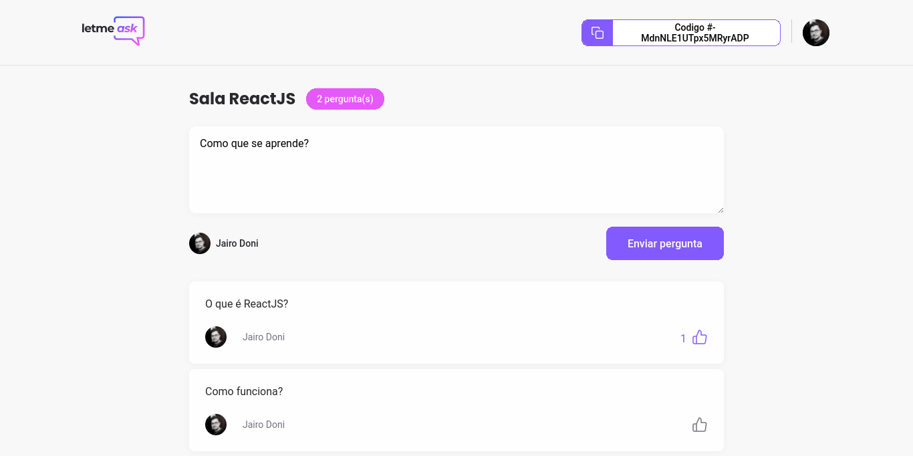
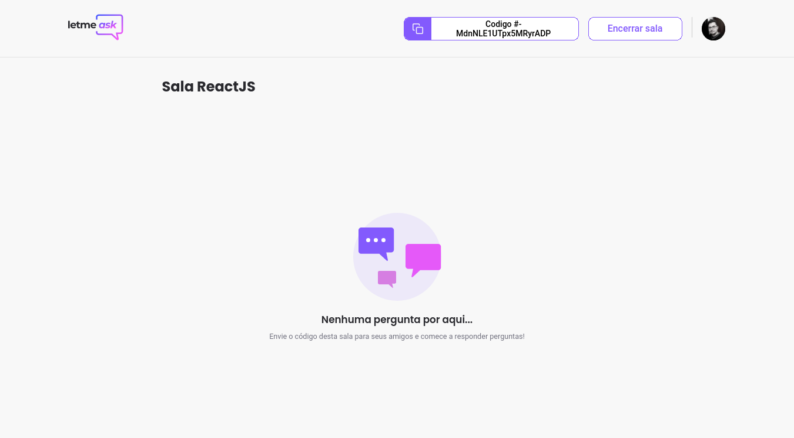
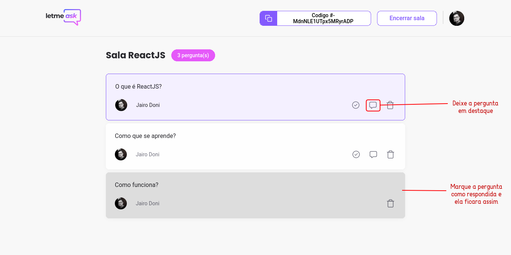
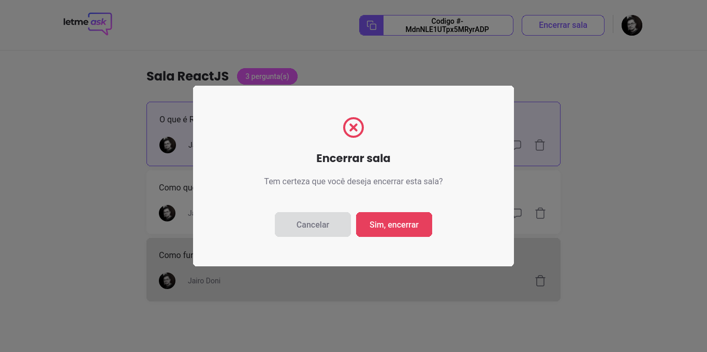

<div 
  align="center"
  style="
    background: #eee;
    border-radius: 1.5rem;
    display: flex;
    alight-itens:center;
    justify-content: center;
    flex-direction: column;
    padding: 10px 60px;
    margin: 10px 20px;
    border: 2px solid #444444;
  ">
  
  <h1 align="center">
      
  </h1>

[](LICENSE.md)


  <!-- ![GitHub][repository_license_badge] ![React_Badge][web_react_badge] ![Types][typescript_shields] ![Next][next_shields] -->

</div>

<div align="center">

<br>

<p align="center">
  <strong>
      <a href="#-projeto">Projeto</a> &nbsp;|&nbsp; 
  </strong>
  <strong>
      <a href="#-layout">Layout</a> &nbsp;|&nbsp; 
  </strong>
  <strong>
      <a href="#-tecnologias">Tecnologias</a> &nbsp;|&nbsp; 
  </strong>
  <strong>
      <a href="#-como-executar-o-projeto">Executando</a> &nbsp;|&nbsp; 
  </strong>
  <strong>
      <a href="#-referências">Referências</a> &nbsp;|&nbsp; 
  </strong>
  <strong>
      <a href="#-autor">Autor</a> 
  </strong>
</p>

<p align="center">
  
</p>
</div>

## **✨ Preview**
#### Sistema Online: https://letmeask-7a0d1.web.app
---

## **💻 Projeto**

Letmeask é um site que auxilia seus stremmers favoritos ou qualquer pessoa que precise de uma plataforma de gerenciamento de perguntas interagindo com seu publico de forma mais organizada. Letmeask permite criar salas de perguntas onde você pode reunir seu publico para tirar duvidas em tempo real.

#### Features:

- [x] Login com Google.
- [x] Pode acessar salas sem logar em uma conta.
- [x] Não pode fazer perguntas sem fazer login antes.
- [x] Pode dar like em perguntas.
- [x] Pode criar salas com sua propria conta estando logado.
- [x] Pode compartilhar o codigo da sua sala para seu publico.
- [x] Pode destacar perguntas.
- [x] Pode marcar perguntas como respondidas.
- [x] Pode excluir perguntas correspondentes a sala que você criou.
- [x] Pode encerrar sala deixando-a desativada e inacessivel.

---

## **🔖 Layout**

Você pode visualizar o layout do projeto no formato através [desse link](https://www.figma.com/file/9BkYiyIdwwILHNDvZczgEd/Letmeask). Lembrando que você irá precisar ter uma conta no [Figma](http://figma.com/).

#### **Web**

  <div>
    
    <br/>
    <br/>
    
    <br/>
    <br/>
    
    <br/>
    <br/>
    <h2>Telas de Administrador</h2>
    <br/>
    
    <br/>
    <br/>
    
    <br/>
    <br/>
    
    <br/>
    <br/>
    
  <div>

---

## **💻 Tecnologias**

#### **Website** ([React][react])

- **[Typescript][typescript]**
- **[Firebase][firebase]**
- **[React Hook Form][react_hook_form]**
- **[Hook Form Resolvers][resolvers]**
- **[Yup][yup]**
- **[Sass][sass]**
- **[React Hot Toast][react_hot_toast]**
- **[React Modal][react_modal]**
- **[React Icons][react_icons]**

> \* Veja o arquivo <kbd>[package.json](./package.json)</kbd>

#### **Utilitários**

- Editor: **[Visual Studio Code][vscode]**
- Markdown: **[StackEdit][stackedit]**, **<kbd>[Markdown Emoji][markdown_emoji]</kbd>**

---

## **🚀 Como executar o projeto**

### Configurações Iniciais

Primeiro, você precisa ter o <kbd>[NodeJS](https://nodejs.org/en/download/)</kbd> instalado na sua máquina.

Se você estiver utilizando o **Linux**, você pode optar por instalar o **Node** através do gerênciador de versões <kbd>[asdf]</kbd> para facilitar o processo de mudança da versão do **Node**, quando for necessário.

Você pode optar também por utilizar o **yarn** no lugar do **npm**. Você pode instalar clicando nesse <kbd>[link][yarn]</kbd>, ou através do <kbd>[asdf]</kbd>.

Após ter o **Node** instalado, instale as dependências do **React** de forma global, utilizando os comandos:

Instale as dependências contidas nos arquivos `package.json` que se encontram na raíz do repositório. Para instalar as dependências, basta abrir o terminal no diretório e digitar o comando:

```sh
# Instalando as dependencias:
$ npm install

#  ou

$ yarn
```

> Veja a parte de **scripts {}** do arquivo <kbd>[package.json](./package.json)</kbd> para saber quais scripts estão disponíveis.

### Executando o WebSite

```sh
# Executando o website:
$ npm run start

#    ou


$ yarn start
```

<br/>

> Se o browser não abrir automaticamente, acesse: http://localhost:3000.

<br/>

### Configuraçoes de Ambiente

Você precisara logar no firebase e gerar um novo projeto e pegar as variaveis de ambiente dele
para em seguida criar um arquivo ".env.local" para inserir cada chave de segurança que o projeto do firebase
gerou pra você anteriomente.
<br/>

No projeto da sua conta do firebase selecione "Realtime Database" e configure o banco de dados,
quando o banco de dados estiver pronto coloque as regrar(rules), como exemplo
siga o arquivo <kbd>[database.rules.json](./database.rules.json)</kbd>.

<br/>

> Veja o exemplo de arquivo de configurações de ambiente <kbd>[.env.local.exemplo.txt](./.env.local.example.txt)</kbd>

---

## **📚 Referências**

- [Blog Rocketseat][rocketseat_blog]
- [Rocketseat][rocketseat_plataforma]
- [ReactJS][react_doc] | [ReactJS pt-BR][react_doc_ptbr]
- [Node.js][node]

## **👨‍🚀 Autor**

<a href="https://github.com/jairodoni">
 
  <br />
  <sub>
    <b>Jairo Doni Prudente Junior</b>
  </sub>
</a>
<br />

👋 Entre em contato!

[](https://www.linkedin.com/in/jairodoni/)
[](mailto:jairo.doni97@gmail.com)

## **📝 Licença**

Esse projeto está sob a licença MIT. Veja o arquivo [LICENSE](LICENSE.md) para mais detalhes.

<!-- Referencias -->

[rocketseat_blog]: https://blog.rocketseat.com.br/
[rocketseat_plataforma]: https://app.rocketseat.com.br/
[rocketseat_site]: https://rocketseat.com.br/

<!-- Badges -->

[repository_license_badge]: https://img.shields.io/github/license/JairoDoni/NLW-1.0
[web_react_badge]: https://img.shields.io/badge/web-react-blue
[typescript_shields]: https://img.shields.io/badge/types-Typescript-blue
[next_shields]: https://img.shields.io/badge/vercel-Next.js-lightgrey

<!-- Techs -->

[react]: https://reactjs.org/
[react_doc]: https://reactjs.org/docs/getting-started.html
[react_doc_ptbr]: https://pt-br.reactjs.org/docs/getting-started.html
[node]: https://nodejs.org/en/
[vscode]: https://code.visualstudio.com/
[typescript]: https://www.typescriptlang.org/
[firebase]: https://firebase.google.com
[react_hook_form]: https://react-hook-form.com
[resolvers]: https://github.com/react-hook-form/resolvers
[yup]: https://github.com/jquense/yup
[react_hot_toast]: https://react-hot-toast.com
[sass]: https://sass-lang.com
[react_icons]: https://react-icons.github.io/react-icons/
[react_modal]: https://github.com/reactjs/react-modal
[asdf]: https://github.com/asdf-vm/asdf
[yarn]: https://classic.yarnpkg.com/en/docs/install/#debian-stable
[stackedit]: https://stackedit.io
[markdown_emoji]: https://gist.github.com/rxaviers/7360908
